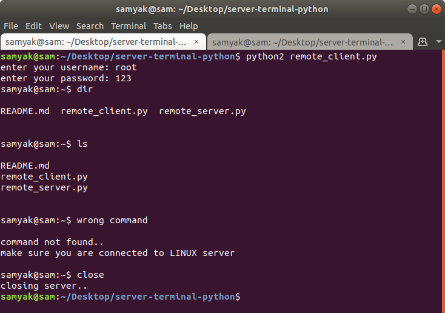

# server-terminal-python

Python code for controlling server's terminal **(cmd for windows)** and executing command through client.  
but for that, server will first authenticate client before giving access.  

### **client**(remote_client.py)

* Checks os type for server as client can control both windows or linux server.  
* Sends its username , password for authentication to server.  
* Send commands(messages) to server for execution and receives output.  
* Received output is shown on clients terminal not on server.  
* After 5 commands clients screen gets cleared automatically.  
* Wrong or dangerous commands are handeled accordingly by client.  
* 'close' or 'exit' command will close connection between server and client.  

**linux-client**  

  

### **server**(remote_server.py)

* Authenticate client's username and password . If correct give access to its terminal.  
* Executes clients message as commands and send output directly to client.  
* Closes connection with client if 'close' or 'exit' command is found to be executed.  

### Some points  
* ipv4 and udp is used for making socket.  
* 
